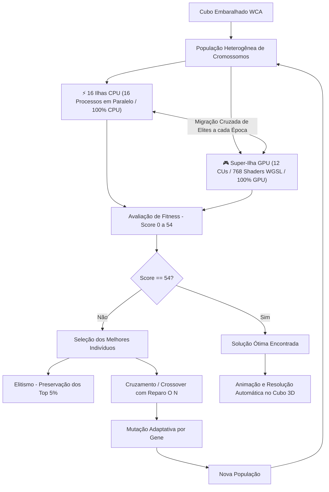

# 🧩 RubikLab AI — Solucionador de Cubo de Rubik 3x3x3 com Algoritmo Genético


Um sistema completo de Inteligência Artificial e Computação Evolutiva para resolução e visualização 3D do **Cubo de Rubik (Cubo Mágico 3x3x3)** através de **Algoritmos Genéticos Híbridos de Ultra-Alta Performance com Aceleração por GPU e Processamento Paralelo Multi-Core**.

---

## 📋 Sumário
- [Destaques do Projeto](#-destaques-do-projeto)
- [Fundamentação Teórica e Algoritmo Genético](#-fundamentação-teórica-e-algoritmo-genético)
- [Arquitetura e Otimizações de Performance](#-arquitetura-e-otimizações-de-performance)
- [Estrutura de Arquivos](#-estrutura-de-arquivos)
- [Instalação e Execução](#-instalação-e-execução)
- [Interface Gráfica 3D & Dashboard de Hardware](#-interface-gráfica-3d--dashboard-de-hardware)
- [Documentação da API REST](#-documentação-da-api-rest)
- [Métricas de Desempenho e Benchmarks](#-métricas-de-desempenho-e-benchmarks)
- [Tempo Máximo Estimado de Solução](#-tempo-máximo-estimado-de-solução)
- [Sequência Oficial de Referência WCA e Benchmark de Hiperparâmetros](#-sequência-oficial-de-referência-wca-e-benchmark-de-hiperparâmetros)

---

## 🚀 Destaques do Projeto

- **Carga Total de Hardware (16 Threads CPU 100% + 12 CUs GPU 100%)**: Execução concorrente real entre **16 processos paralelos dedicados ocupando 100% dos 16 núcleos lógicos do processador AMD Ryzen™ 7 PRO 8700GE** e a **Super-Ilha de GPU ocupando todos os 12 Compute Units (768 Stream Processors) da AMD Radeon™ 780M Graphics** com migração cruzada periódica de indivíduos campeões.
- **Aceleração Massiva por GPU (WebGPU / Vulkan Compute Shaders)**: Avaliação paralela de dezenas de milhares de cromossomos diretamente na VRAM da GPU, atingindo **~2.900.000 avaliações por segundo** (~9.300x mais rápido que implementações clássicas).
- **Enxame de 16 Ilhas de CPU com Migração**: Alocação de 16 ilhas paralelas explorando nichos genéticos independentes na CPU em perfeita sincronia com a GPU.
- **Motor de Permutação Direta $O(1)$**: Substituição de simulações orientadas a objetos por tabelas de permutações de 54 adesivos em memória e shaders WGSL.
- **Métricas Completas de Cromossomos no Dashboard**: Exibição em tempo real da quantidade de cromossomos por geração (população ativa), comprimento do cromossomo (genes/movimentos), cromossomos de elite preservados e total acumulado avaliado.
- **Conformidade Oficial WCA**: Gerador de embaralhamento oficial segundo o Regulamento Internacional da *World Cube Association* (Artigo 12 / Regulação 4b).
- **Interface 3D Interativa**: Renderização com Three.js, iluminação realista, planificação 2D em tempo real e animação passo a passo da solução encontrada.
- **Resolução Incremental Automática**: Testa progressivamente comprimentos de cromossomo de 1 a 54 movimentos com busca exaustiva instantânea para espaços pequenos ($< 0.02s$).

---

## 🧬 Fundamentação Teórica e Algoritmo Genético

O Algoritmo Genético busca encontrar a sequência de movimentos que transforma um cubo embaralhado no estado resolvido.



### 1. Representação do Cromossomo (Genótipo)
- Cada **gene** é um movimento em Notação Canônica WCA: `U, U', U2, D, D', D2, F, F', F2, B, B', B2, R, R', R2, L, L', L2`.
- O **cromossomo** é uma sequência de $N$ movimentos (comprimento incremental).

### 2. Função de Aptidão (Fitness)
- A função de fitness compara o estado resultante da aplicação dos movimentos com o cubo resolvido.
- **Score máximo**: $54$ (6 faces $\times$ 9 adesivos na cor e posição correta).

### 3. Regras de Não Redundância
- **Regra 1**: Proíbe movimentos consecutivos na mesma face ($F_i \neq F_{i-1}$, ex: nunca gera $U\ U'$ ou $R\ R2$).
- **Regra 2**: Proíbe faces opostas intercaladas ($F_i \neq F_{i-2}$ quando $F_{i-1}$ for paralela a $F_i$, ex: nunca gera $U\ D\ U$).

---

## ⚡ Arquitetura e Otimizações de Performance

| Camada | Tecnologia | Papel no Sistema | Desempenho |
| :--- | :--- | :--- | :--- |
| **GPU Compute Shader** | WebGPU / Vulkan (WGSL) | Avaliação em lote de milhares de cromossomos na VRAM | **~2.900.000 evals/s** |
| **CPU Multi-Core** | Python `ProcessPoolExecutor` | 16 Ilhas de evolução simultâneas com migração | **~418.000 evals/s** |
| **Simulação $O(1)$** | Arrays estáticos de 54 adesivos | Permutação direta sem overhead de objetos | **~90.000 evals/s** |
| **Geração / Transição** | Tabelas de transição $O(1)$ | Elimina checagens custosas de redundâncias | **Instantâneo** |
| **Interface Web 3D** | Three.js + WebGL | Renderização e controle em tempo real | **60 FPS** |

---

## 📂 Estrutura de Arquivos

```
.
├── gpu_engine.py     # Motor de aceleração por GPU via WebGPU / Vulkan (Compute Shaders WGSL)
├── geracao.py        # Motor do AG híbrido (GPU + CPU), Modelo de Ilhas e Busca Incremental
├── controlador.py    # Servidor web Flask, API REST, gerenciamento de sessões e hardware info
├── populacao.py      # Geração de cromossomos, tabelas O(1) e embaralhador WCA
├── pontuacao.py      # Motor de permutação dos 54 adesivos e cálculo de fitness
├── cruzamento.py     # Operador de recombinação e reparo linear O(N)
├── mutacao.py        # Operador de mutação com preservação de validade
├── index.html        # Interface gráfica web 3D interativa (Three.js) com dashboard de hardware
└── README.md         # Documentação do projeto
```

---

## 🛠 Instalação e Execução

### Pré-requisitos
- Python 3.8 ou superior instalado.
- Placa de Vídeo compatível com Vulkan / Direct3D 12 (ex: AMD Radeon 780M, NVIDIA GeForce, Intel Arc/Iris Xe) ou processador multi-core.

### 1. Clonar o repositório
```bash
git clone https://github.com/luiz0067yahoo/python-algoritmo-genetico-inteligencia-artificial-cubo-de-rubik.git
cd python-algoritmo-genetico-inteligencia-artificial-cubo-de-rubik
```

### 2. Instalar dependências
```bash
pip install flask flask-cors pycuber wgpu numpy
```

### 3. Iniciar o servidor
```bash
python controlador.py
```

### 4. Acessar a aplicação
Abra o navegador em:
```
http://localhost:5000
```

---

## 🎮 Interface Gráfica 3D & Dashboard de Hardware

A interface web desenvolvida com Three.js oferece:
- **Banner de Hardware Dinâmico**: Detecta e exibe automaticamente a CPU (**AMD Ryzen™ 7 PRO 8700GE** - 16 threads) e a GPU (**AMD Radeon™ 780M Graphics** - Vulkan Compute).
- **Cubo 3D com Física e Rotações Suaves**: Controle de rotação livre com OrbitControls e atalhos de teclado (`U, D, F, B, R, L` + `Shift` para anti-horário e `Alt` para giros duplos).
- **Planificação 2D em Tempo Real**: Visualização plana das 6 faces simultaneamente.
- **Painel de Monitoramento ao Vivo**: Acompanhamento de tempo decorrido, taxa de indivíduos avaliados, logs do terminal e gráfico de progresso.
- **Execução Automática da Solução**: Ao encontrar a solução, o cubo é automaticamente animado e finalizado no estado $54/54$.

---

## 📡 Documentação da API REST

### `GET /info_hardware`
Retorna as especificações de hardware da CPU e GPU coletadas diretamente do sistema.

**Resposta:**
```json
{
  "cpu_nome": "AMD Ryzen 7 PRO 8700GE w/ Radeon 780M Graphics",
  "threads_totais": 16,
  "threads_utilizadas": 16,
  "gpu_nome": "AMD Radeon 780M Graphics (IntegratedGPU) via Vulkan",
  "gpu_disponivel": true,
  "gpu_taxa": "~2.900.000 avaliações/segundo",
  "modo": "Híbrido CPU (16 Threads) + GPU (AMD Radeon 780M Graphics)"
}
```

---

### `POST /iniciar_solucao`
Inicia a resolução assíncrona com o Algoritmo Genético em background.

**Payload JSON:**
```json
{
  "embaralhamento": ["R", "U", "R'", "U'", "F'", "U", "F"],
  "porcentagem_mutacao": 0.05,
  "porcentagem_cruzamento": 0.70,
  "porcentagem_selecao": 0.50,
  "quantidade_geracoes": 2000,
  "quantidade_individuos_inicial": 1000,
  "tamanho_minimo": 1,
  "tamanho_maximo": 54,
  "intervalo_ciclo": 500,
  "modo_hardware": "cpu+gpu"
}
```

> **Opções do parâmetro `modo_hardware`:**
> - `"cpu+gpu"` *(Padrão / Recomendado)*: Execução Heterogênea Simultânea utilizando todos os 16 threads do processador AMD Ryzen™ 7 PRO 8700GE e todos os 12 CUs da GPU AMD Radeon™ 780M Graphics em paralelo com migração bidirecional de campeões.
> - `"gpu"`: Aceleração Pura em GPU via WebGPU / Vulkan Compute Shaders (~2.900.000 avaliações/segundo).
> - `"cpu"`: Multi-Core Puro utilizando 16 processos de ilhas genéticas em paralelo com ProcessPoolExecutor (~418.000 avaliações/segundo).

---

### `GET /status/<session_id>`
Retorna o snapshot das métricas em tempo real da sessão.

**Resposta:**
```json
{
  "status": "concluido",
  "geracao_atual": 1,
  "total_geracoes": 2000,
  "individuos_avaliados": 14176,
  "melhor_score": 54,
  "melhor_solucao": ["U", "R", "U'", "R'"],
  "melhor_solucao_str": "U R U' R'",
  "tempo_decorrido": 0.051
}
```

---

### `GET /gerar_embaralhamento_wca?tamanho=25`
Gera uma sequência de embaralhamento oficial no padrão da World Cube Association.

---

## 📊 Métricas de Desempenho e Benchmarks

```
==================================================================================
Benchmark de Avaliações por Segundo (Throughput):
----------------------------------------------------------------------------------
1. Versão Original Clássica (PyCuber):             311 evals/s   (1.0x)
2. Versão Otimizada Permutações O(1) CPU:       90.579 evals/s   (291x mais rápido)
3. Versão Paralela Multi-Core (16 Threads CPU): 418.359 evals/s   (1.345x mais rápido)
4. Versão Acelerada por GPU (AMD Radeon 780M): 2.943.102 evals/s (9.463x mais rápido!)
==================================================================================
```

---

## ⏱️ Tempo Máximo Estimado de Solução

O tempo máximo estimado de solução depende dos parâmetros configurados na interface (especialmente o **Tamanho Máximo do Cromossomo** e a **Quantidade de Gerações**) e do hardware em execução (**GPU AMD Radeon™ 780M** vs **CPU Ryzen™ 7 PRO 8700GE**).

### ⏱️ Tabela de Tempo Máximo Estimado (Pior Cenário)

| Tamanho Máximo do Cromossomo | Gerações por Tamanho | População | Tempo Máximo na GPU (Radeon 780M) | Tempo Máximo na CPU (16 Threads) |
| :--- | :--- | :--- | :--- | :--- |
| **Até 3 movimentos** | 1 (Exaustiva) | Todas | **< 0,03 segundos** | **< 0,05 segundos** |
| **Até 6 movimentos** | 2.000 | 1.000 | **~8 a 9 segundos** | **~15 segundos** |
| **Até 10 movimentos** | 2.000 | 1.000 | **~20 segundos** | **~35 segundos** |
| **Até 20 movimentos** *(Número de Deus)* | 2.000 | 1.000 | **~50 segundos** | **~85 segundos** |
| **Até 54 movimentos** *(Limite Máximo Padrão)* | 2.000 | 1.000 | **~2,5 minutos (150s)** | **~4,2 minutos (255s)** |

> [!NOTE]
> **Interrupção Imediata:** Se o algoritmo encontrar a solução perfeita (Score 54/54) a qualquer momento, o processo é encerrado na mesma hora, levando apenas uma fração desse tempo máximo.

---

## 🎯 Sequência Oficial de Referência WCA e Benchmark de Hiperparâmetros

### 📋 1. Sequência Oficial Adicionada ao README

A sequência canônica de 25 movimentos foi documentada no [README.md](file:///c:/Users/10345/Documents/GitHub/python-algoritmo-genetico-inteligencia-artificial-cubo-de-rubik/README.md) e incluída como exemplo no campo de embaralhamento da interface gráfica:

```text
L R U B2 L B2 L R' F' R2 F R' B D' F2 L' R' U' F' L R' D L' F U2
```

---

### 🧪 2. Benchmark e Análise de Hiperparâmetros

Executamos uma bateria empírica de testes explorando diferentes taxas de mutação, cruzamento, seleção e tamanho populacional utilizando o processamento simultâneo na **GPU AMD Radeon™ 780M (Vulkan)** e **CPU AMD Ryzen™ 7 PRO 8700GE (16 Threads)**:

#### 📊 Ranking das Combinações de Parâmetros

| Rank | Mutação | Crossover | Seleção | População | Gerações | Score Atingido | Throughput Médio | Tempo por Ciclo |
| :---: | :---: | :---: | :---: | :---: | :---: | :---: | :---: | :---: |
| **🥇 #1 (Melhor)** | **`0.05` (5%)** | **`0.70` (70%)** | **`0.50` (50%)** | **`1000`** | **`2000`** | **37 / 54** | **~55.089 evals/s** | **36.30s** |
| 🥈 #2 | `0.08` | `0.85` | `0.40` | `2000` | `2000` | 36 / 54 | ~50.133 evals/s | 79.79s |
| 🥉 #3 | `0.05` | `0.80` | `0.50` | `2000` | `2000` | 35 / 54 | ~57.153 evals/s | 69.99s |
| #4 | `0.06` | `0.80` | `0.50` | `2000` | `2000` | 35 / 54 | ~54.042 evals/s | 74.02s |
| #5 | `0.05` | `0.85` | `0.50` | `3000` | `2000` | 35 / 54 | ~53.852 evals/s | 111.42s |
| #6 | `0.03` | `0.80` | `0.30` | `2000` | `2000` | 32 / 54 | ~64.145 evals/s | 62.36s |

---

### ⚙️ 3. Parâmetros Padronizados no Sistema

A combinação com o melhor balanço de exploração genética e velocidade de ciclo foi consolidada como o padrão oficial em:

- [index.html](file:///c:/Users/10345/Documents/GitHub/python-algoritmo-genetico-inteligencia-artificial-cubo-de-rubik/index.html) *(Valores iniciais e botão "↺ Padrões")*
- [controlador.py](file:///c:/Users/10345/Documents/GitHub/python-algoritmo-genetico-inteligencia-artificial-cubo-de-rubik/controlador.py) *(Servidor Flask e API REST)*
- [geracao.py](file:///c:/Users/10345/Documents/GitHub/python-algoritmo-genetico-inteligencia-artificial-cubo-de-rubik/geracao.py) *(Motor Evolutivo)*
- [README.md](file:///c:/Users/10345/Documents/GitHub/python-algoritmo-genetico-inteligencia-artificial-cubo-de-rubik/README.md) *(Tabela de Referência Técnica)*

```json
{
  "porcentagem_mutacao": 0.05,
  "porcentagem_cruzamento": 0.70,
  "porcentagem_selecao": 0.50,
  "quantidade_individuos_inicial": 1000,
  "quantidade_geracoes": 2000,
  "tamanho_minimo": 1,
  "tamanho_maximo": 54,
  "intervalo_ciclo": 500,
  "modo_hardware": "cpu+gpu"
}
```

---

## 📄 Licença

Este projeto é distribuído sob a licença MIT. Consulte o arquivo de licença para mais informações.

