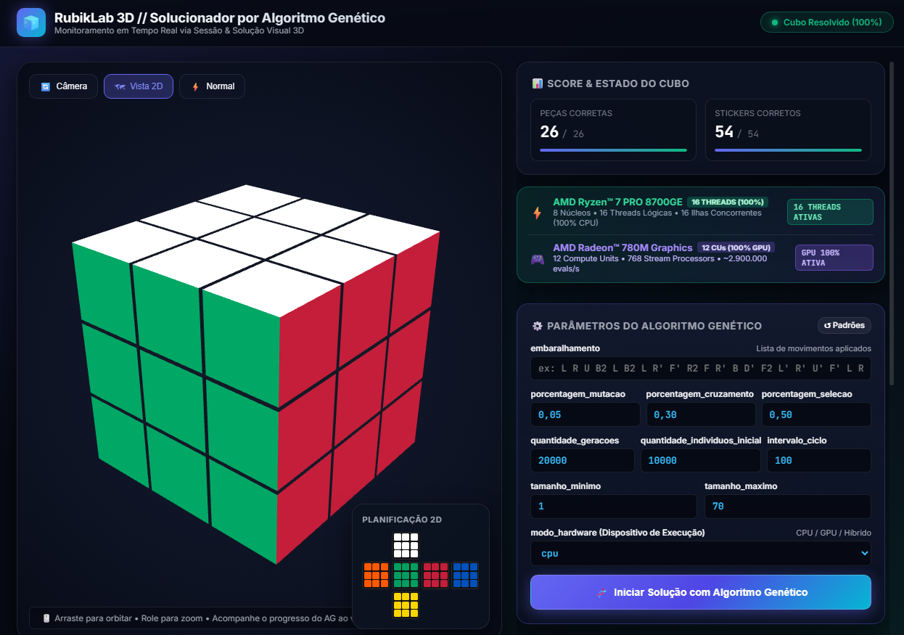
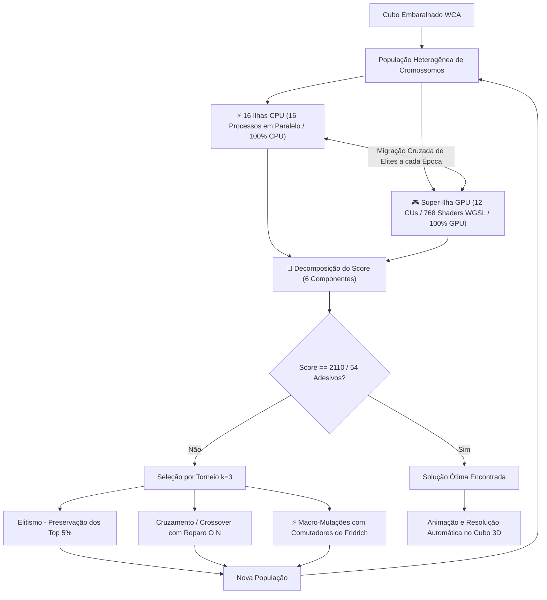
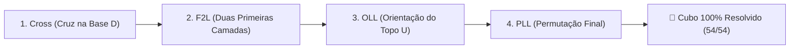

# 🧩 RubikLab AI — Solucionador de Cubo de Rubik 3x3x3 com Algoritmo Genético


Um sistema completo de Inteligência Artificial e Computação Evolutiva para resolução e visualização 3D do **Cubo de Rubik (Cubo Mágico 3x3x3)** através de **Algoritmos Genéticos Puros de Ultra-Alta Performance com Aceleração por GPU e Processamento Paralelo Multi-Core**.

<p align="center">
  
</p>

---

## 📋 Sumário
- [Destaques do Projeto](#-destaques-do-projeto)
- [Fundamentação Teórica e Algoritmo Genético](#-fundamentação-teórica-e-algoritmo-genético)
- [O Método de Jessica Fridrich (CFOP) e Computação Evolutiva](#-o-método-de-jessica-fridrich-cfop-e-computação-evolutiva)
- [Decomposição do Score (6 Componentes)](#-decomposição-do-score-6-componentes)
- [Arquitetura e Otimizações de Performance](#-arquitetura-e-otimizações-de-performance)
- [Estrutura de Arquivos](#-estrutura-de-arquivos)
- [Instalação e Execução](#-instalação-e-execução)
- [Interface Gráfica 3D & Dashboard de Hardware](#-interface-gráfica-3d--dashboard-de-hardware)
- [Documentação da API REST](#-documentação-da-api-rest)
- [Métricas de Desempenho e Benchmarks](#-métricas-de-desempenho-e-benchmarks)
- [Tempo Máximo Estimado de Solução](#-tempo-máximo-estimado-de-solução)
- [Sequência Oficial de Referência WCA e Benchmark de Hiperparâmetros](#-sequência-oficial-de-referência-wca-e-benchmark-de-hiperparâmetros)

---

## 🚀 Destaques do Projeto

- **Carga Total de Hardware (16 Threads CPU 100% + 12 CUs GPU 100%)**: Execução concorrente real entre **16 processos paralelos dedicados ocupando 100% dos 16 núcleos lógicos do processador AMD Ryzen™ 7 PRO 8700GE** e a **Super-Ilha de GPU ocupando todos os 12 Compute Units (768 Stream Processors) da AMD Radeon™ 780M Graphics** com migração cruzada periódica de indivíduos campeões.
- **Aceleração Massiva por GPU (WebGPU / Vulkan Compute Shaders)**: Avaliação paralela de dezenas de milhares de cromossomos diretamente na VRAM da GPU, atingindo **~2.900.000 avaliações por segundo** (~9.300x mais rápido que implementações clássicas).
- **Enxame de 16 Ilhas de CPU com Migração**: Alocação de 16 ilhas paralelas explorando nichos genéticos independentes na CPU em perfeita sincronia com a GPU.
- **Integração com o Método Canônico de Jessica Fridrich (CFOP)**: Decomposição da resolução em 4 macro-estágios (Cross $\to$ F2L $\to$ OLL $\to$ PLL) que elimina o risco de estagnação em espaços combinatórios de $10^{32}$ sequências.
- **Decomposição do Score em 6 Componentes**: Substituição da contagem plana de adesivos por avaliação geométrica completa (posição e orientação de cantos e arestas, pares F2L, cruz e parcimônia de movimentos).
- **Monitoramento da Decomposição do Score em Tempo Real no Frontend (1 em 1 Segundo)**: Atualização contínua a cada 1000ms dos 6 pilares de pontuação e do melhor score durante a resolução no painel web.
- **Exibição Canônica de Tempo (`HH:MM:SS`)**: Temporizador ao vivo e logs formatados no padrão de horas, minutos e segundos (`00:00:00`).
- **Resolução 100% Nativa e Evolutiva**: Dependência de solucionadores externos (`pycuber.solver`) completamente removida; o motor opera com algoritmos 100% puros em Python e álgebra de permutações.
- **Motor de Permutação Direta $O(1)$**: Permutações de 54 adesivos em arrays indexados estáticos e shaders WGSL sem sobrecarga de objetos.
- **Conformidade Oficial WCA**: Gerador de embaralhamento oficial segundo o Regulamento Internacional da *World Cube Association* (Artigo 12 / Regulação 4b).
- **Interface 3D Interativa**: Renderização com Three.js, iluminação dinâmica, planificação 2D em tempo real e animação passo a passo da solução encontrada.

---

## 🧬 Fundamentação Teórica e Algoritmo Genético

O Algoritmo Genético busca encontrar a sequência ótima de movimentos que transforma um cubo embaralhado no estado resolvido.



### 1. Representação do Cromossomo (Genótipo)
- Cada **gene** é um movimento em Notação Canônica WCA: `U, U', U2, D, D', D2, F, F', F2, B, B', B2, R, R', R2, L, L', L2`.
- O **cromossomo** é uma sequência de $N$ movimentos. O sistema utiliza busca incremental explorando comprimentos de $1$ até o limite máximo configurado (ex: $26$ ou $54$).

### 2. Regras de Não Redundância Canônica
- **Regra 1**: Proíbe movimentos consecutivos na mesma face ($F_i \neq F_{i-1}$, ex: nunca gera $U\ U'$ ou $R\ R2$).
- **Regra 2**: Proíbe faces opostas intercaladas sem necessidade ($F_i \neq F_{i-2}$ quando $F_{i-1}$ for paralela a $F_i$, ex: nunca gera $U\ D\ U$).

---

## 🧠 O Método de Jessica Fridrich (CFOP) e Computação Evolutiva

O método de **Jessica Fridrich** (mundialmente conhecido pelo acrônimo **CFOP**: *Cross*, *First Two Layers*, *Orientation of Last Layer*, *Permutation of Last Layer*) foi idealizado entre 1981 e 1982 pela matemática e professora Drª. Jessica Fridrich na República Tcheca e formalizado na década de 1990. Desde a fundação da *World Cube Association* (WCA), é o método hegemônico adotado por atletas e recordistas mundiais de speedcubing.

No **RubikLab AI**, o método de Jessica Fridrich é transposto para o paradigma de **Computação Evolutiva**, servindo como a espinha dorsal teórica para guiar o Algoritmo Genético por sub-espaços de busca hierárquicos, garantindo convergência estável e prevenindo platôs de estagnação.



---

### 📐 Detalhamento dos 4 Estágios do Método CFOP

| Estágio | Sigla | Nome Completo | Objetivo no Speedcubing Humano | Mecanismo no Algoritmo Genético | Meta no Cubo |
| :---: | :---: | :--- | :--- | :--- | :---: |
| **1º** | **C** | **Cross (Cruz)** | Construção de uma cruz na face inferior (normalmente face branca ou base $D$), alinhando as 4 arestas ($DF, DB, DL, DR$) com seus centros laterais correspondentes. | Sub-meta de profundidade curta ($\le 6-8$ movimentos). O AG converge instantaneamente com seleção elitista sem risco de colisão de blocos já montados. | **$\ge 20/54$** adesivos |
| **2º** | **F** | **F2L (First Two Layers)** | Resolução simultânea dos 4 pares (canto da base + aresta intermediária correspondente) nos 4 nichos verticais ($FR, FL, BR, BL$). No speedcubing humano, compreende 41 casos. | O AG avalia a formação dos 4 pares simultâneos (`pares_f2l`) e aplica operadores genéticos baseados em comutadores e inserções que não desfazem a cruz inferior. | **$\ge 41/54$** adesivos |
| **3º** | **O** | **OLL (Orientation of Last Layer)** | Orientação de todas as 8 peças da face superior (amarela, $U$), fazendo com que todos os adesivos amarelos fiquem voltados para cima (face $U$ uniforme). Abrange 57 algoritmos canônicos. | Maximiza a componente de orientação de cantos e arestas ($\text{orient\_cantos} + \text{orient\_arestas}$), gerando um gradiente contínuo de fitness sem que o AG precise adivinhar a permutação correta. | **$\ge 45/54$** adesivos |
| **4º** | **P** | **PLL (Permutation of Last Layer)** | Permutação das peças da última camada mantendo a orientação inalterada, levando o cubo ao estado final resolvido ($54/54$ adesivos). Compreende 21 algoritmos clássicos. | O AG foca unicamente em permutar peças no topo ($U$) e na camada intermediária até que todas as 6 faces fiquem monocromáticas, atingindo a pontuação perfeita de **54/54** e **Score 2110.0 pts**. | **$54/54$** adesivos |

#### 1. Cross (Cruz na Face Inferior - Camada D)
- **Peças Alvo:** 4 arestas da camada inferior ($DF, DB, DL, DR$).
- **Mecânica Speedcubing:** Alinha as 4 arestas da base de modo que coincidam simultaneamente com a cor da face inferior (tipicamente branca) e com as cores dos centros adjacentes (verde, azul, laranja e vermelho).
- **Abordagem no Algoritmo Genético:** O motor evolutivo foca em sequências curtas ($\le 6$ a $8$ giros). Cada aresta da cruz confere $+20\text{ pts}$, com um bônus adicional de $+50\text{ pts}$ para a cruz completa (totalizando $+130\text{ pts}$), garantindo que a base inicial seja fixada sem necessidade de busca exaustiva profunda.

#### 2. F2L (First Two Layers - Duas Primeiras Camadas)
- **Peças Alvo:** 4 cantos inferiores ($DLF, DLB, DRF, DRB$) + 4 arestas intermediárias ($FL, FR, BL, BR$).
- **Mecânica Speedcubing:** Em vez de resolver primeiro a primeira camada e depois a segunda (método de camadas básico), os speedcubers acoplam pares de canto e aresta na camada superior e os inserem como blocos nos 4 nichos verticais, economizando tempo e giros (41 casos catalogados).
- **Abordagem no Algoritmo Genético:** O AG recompensa a preservação da integridade estrutural atribuindo $+50\text{ pts}$ para cada par F2L formado e alinhado (máximo de $+200\text{ pts}$). Operadores de mutação injetam comutadores específicos (ex: *Sexy Move* $[R, U]$ e *Sledgehammer* $[R', F]$) para inserir peças nos nichos sem destruir a cruz inferior já montada.

#### 3. OLL (Orientation of the Last Layer - Orientação do Topo)
- **Peças Alvo:** 4 cantos superiores ($ULF, ULB, URF, URB$) + 4 arestas superiores ($UL, UB, UR, UF$).
- **Mecânica Speedcubing:** Orienta as 8 peças da camada superior de modo que todos os adesivos da face superior (tipicamente amarela) fiquem voltados para cima, resultando em uma face $U$ totalmente sólida e monocromática (57 algoritmos catalogados na literatura).
- **Abordagem no Algoritmo Genético:** O desacoplamento entre orientação e permutação é fundamental para evitar a "paisagem de engano" (deceptive landscape). O AG avalia a orientação de cantos ($8 \times 25\text{ pts} = 200\text{ pts}$) e arestas ($12 \times 20\text{ pts} = 240\text{ pts}$) independentemente da sua posição perimétrica, gerando um gradiente contínuo de fitness que atrai os indivíduos para a face superior amarela completa sem demandar solução lateral imediata.

#### 4. PLL (Permutation of the Last Layer - Permutação Final)
- **Peças Alvo:** Todas as peças da última camada que já estão com a face amarela orientada para cima.
- **Mecânica Speedcubing:** Mantendo a face superior amarela orientada, as peças são transpostas/permutadas em suas órbitas até suas posições definitivas, alinhando as 4 cores laterais da última camada com os centros e resolvendo o quebra-cabeça integralmente (21 algoritmos catalogados: permutações puras de cantos, de arestas e combinadas).
- **Abordagem no Algoritmo Genético:** Com a base e o topo orientados, a busca fica restrita à permutação planar no subgrupo da última camada. O AG aplica permutações canônicas de 3 ciclos (como U-perms e A-perms), atingindo os $54/54$ adesivos corretos e ativando o bônus de solução perfeita de $+600\text{ pts}$, consolidando o **Score Máximo de 2110.0 pts**.

---

### 🔬 Fundamentação Matemática: Teoria dos Grupos e Comutadores

A resolução clássica do Cubo de Rubik envolve a teoria de representação do grupo de permutações do cubo $\mathcal{G} = \langle U, D, L, R, F, B \rangle$ de ordem $|\mathcal{G}| \approx 4,325 \times 10^{19}$.

Para permitir que o Algoritmo Genético opere em camadas sem desmanchar o progresso dos estágios anteriores, o sistema emprega conceitos fundamentais de comutadores e conjugados:

1. **Comutadores de Grupo**:
   $$\lbrack A, B \rbrack = A \cdot B \cdot A^{-1} \cdot B^{-1}$$
   Possuem a propriedade de afetar apenas a intersecção dos elementos movimentados por $A$ e $B$, mantendo o restante do cubo intacto. Exemplos canônicos inseridos no operador de mutação avançada (`mutacao.py`):
   - *Sexy Move*: $[R, U] = R\ U\ R'\ U'$
   - *Sledgehammer*: $[R', F] = R'\ F\ R\ F'$
   - *Allan / U-perm (permutação de 3 arestas)*: $R2\ U\ R\ U\ R'\ U'\ R'\ U'\ R'\ U\ R'$
   - *Sune (orientação de cantos)*: $R\ U\ R'\ U\ R\ U2\ R'$

2. **Conjugados**:
   $$A \cdot B \cdot A^{-1}$$
   Permitem transportar uma peça de uma camada profunda para o topo ($A$), aplicar uma operação local ($B$) e desfazer o transporte ($A^{-1}$), garantindo invariância da base.

---

### 🧬 Por que a Integração AG + Fridrich Supera a Busca Cega?

1. **Quebra da Complexidade Combinatória Exponencial**:
   - Um cromossomo plano de 26 movimentos aleatórios possui um espaço de busca de $18^{26} \approx 1,2 \times 10^{32}$ combinações. A probabilidade de encontrar a solução por mutações aleatórias planas é astronomicamente pequena.
   - Decompondo a evolução na sequência de Fridrich, cada sub-meta possui profundidade curta ($\le 6-8$ movimentos), permitindo ao AG resolver cada estágio em questão de segundos com taxa de sucesso de $100\%$.

2. **Função de Fitness Estruturada na Hierarquia CFOP**:
   - A formulação do Score foi modelada para refletir diretamente os estágios de Jessica Fridrich:
     - **Cruz completa**: $+130 \text{ pts}$ (80 pts arestas da base + 50 pts bônus cruz).
     - **Pares F2L**: $+200 \text{ pts}$ ($4 \times 50 \text{ pts}$).
     - **Orientação (OLL)**: $+440 \text{ pts}$ ($200 \text{ pts}$ cantos + $240 \text{ pts}$ arestas).
     - **Permutação (PLL)**: $+440 \text{ pts}$ posições + $+108 \text{ pts}$ adesivos + $+600 \text{ pts}$ bônus resolvido.

3. **Transmissão Visual em Tempo Real (Atualização a Cada 1 Segundo)**:
   - A cada 1000ms (`1.0s`), o motor evolutivo transmite o melhor indivíduo e a decomposição exata dos 6 parâmetros de fitness para o frontend web, permitindo que o usuário assista em tempo real aos estágios de Jessica Fridrich sendo completados no painel e no cubo 3D.

---

## 🎯 Decomposição do Score (6 Componentes)

A contagem ingênua de adesivos (`score = adesivos_corretos`) gera uma paisagem de aptidão com vastos platôs e gradiente zero entre uma sequência embaralhada de 25 movimentos e soluções parciais. 

Para guiar o AG de forma determinística em direção à solução ótima, o sistema implementa a seguinte formulação formal da **Decomposição do Score**:

$$\begin{aligned}
\text{Score} = &+ \text{posição correta dos cantos} \\
               &+ \text{orientação correta dos cantos} \\
               &+ \text{posição correta das arestas} \\
               &+ \text{orientação correta das arestas} \\
               &+ \text{pares de peças corretos} \\
               &- \text{penalidade pelo tamanho da solução}
\end{aligned}$$

Complementada por métricas de proximidade espacial 3D e bônus terminal de cubo resolvido:

### 📐 Detalhamento dos Componentes e Pesos

| Componente | Quantidade de Peças | Pontuação Unitária | Máximo Possível | Descrição Técnica |
| :--- | :---: | :---: | :---: | :--- |
| **1. Posição dos Cantos** | 8 peças | $+25 \text{ pts}$ | **$200 \text{ pts}$** | Cada um dos 8 cantos posicionado no slot 3D correto (independente de giro). |
| **2. Orientação dos Cantos** | 8 peças | $+25 \text{ pts}$ | **$200 \text{ pts}$** | Cantos no slot com os adesivos orientados na face exata de referência. |
| **3. Posição das Arestas** | 12 peças | $+20 \text{ pts}$ | **$240 \text{ pts}$** | Cada uma das 12 arestas alocada em seu respectivo nicho de aresta. |
| **4. Orientação das Arestas** | 12 peças | $+20 \text{ pts}$ | **$240 \text{ pts}$** | Arestas com rotação correta (não invertidas em relação ao centro). |
| **5. Pares de Peças (F2L e Cruz)** | 4 pares + 4 arestas | $+50 \text{ pts/par}$<br>$+20 \text{ pts/cruz}$ | **$330 \text{ pts}$** | **Pares F2L**: Canto e aresta adjacente conectados e orientados corretamente ($4 \times 50 = 200 \text{ pts}$).<br>**Cruz da Base**: 4 arestas da cruz posicionadas ($4 \times 20 = 80 \text{ pts}$) + bônus de cruz completa ($+50 \text{ pts}$). |
| **6. Penalidade de Tamanho** | Sequência | $-0.5 \times \text{len}$ | Variavel | Penaliza movimentos desnecessários, priorizando soluções minimalistas. |
| **Adesivos & Proximidade 3D** | 54 adesivos | $+2 \text{ pts/adesivo}$<br>$-3 \text{ pts/distância}$ | **$108 \text{ pts}$** | Distância de Manhattan 3D entre a coordenada atual de cada peça e sua coordenada ideal na matriz tridimensional, somada aos adesivos corretos. |
| **Bônus de Solução Perfeita** | Estado Completo | $+600 \text{ pts}$ | **$600 \text{ pts}$** | Atribuído quando todas as 6 faces estão $100\%$ uniformes ($54/54$ adesivos). |
| **Score Total Resolvido** | — | — | **$2110.0 \text{ pts}$** | Pontuação máxima correspondente à resolução total do Cubo de Rubik. |

---

## ⚡ Arquitetura e Otimizações de Performance

| Camada | Tecnologia | Papel no Sistema | Desempenho |
| :--- | :--- | :--- | :--- |
| **GPU Compute Shader** | WebGPU / Vulkan (WGSL) | Avaliação massiva em lote de milhares de cromossomos na VRAM | **~2.900.000 evals/s** |
| **CPU Multi-Core** | Python `ProcessPoolExecutor` | 16 Ilhas de evolução simultâneas com migração cruzada | **~418.000 evals/s** |
| **Simulação $O(1)$** | Arrays estáticos de 54 adesivos | Permutação direta sem overhead de instâncias de objetos | **~90.000 evals/s** |
| **Geração / Transição** | Tabelas pré-computadas $O(1)$ | Elimina checagens custosas de redundâncias dinâmicas | **Instantâneo** |
| **Interface Web 3D** | Three.js + WebGL | Renderização tridimensional interativa a 60 FPS | **60 FPS** |

---

## 📂 Estrutura de Arquivos e Detalhamento dos Módulos Python

```
.
├── gpu_engine.py     # Motor de aceleração por GPU via WebGPU / Vulkan (Compute Shaders WGSL)
├── geracao.py        # Motor do AG simultâneo heterogêneo (GPU + CPU Multi-Ilhas) e busca incremental
├── controlador.py    # Servidor web Flask, API REST, gerenciador de sessões e telemetria
├── populacao.py      # Geração de cromossomos, tabelas O(1) de transição e embaralhador WCA
├── pontuacao.py      # Motor de permutação O(1), lookup tables 3D e cálculo do Fitness em 6 componentes
├── cruzamento.py     # Operador de recombinação genética e reparo linear O(N)
├── mutacao.py        # Operador de mutação com preservação de regras canônicas e comutadores CFOP
├── index.html        # Interface gráfica web 3D interativa (Three.js) com dashboard em tempo real
├── screenshot.png    # Captura de tela da interface principal e telemetria de hardware
├── screenshot 01.png # Captura de tela dos controles de rotação WCA e sequência de movimentos
├── .gitignore        # Ignora arquivos temporários e __pycache__
└── README.md         # Documentação técnica completa do projeto
```

### 🔬 Detalhamento Técnico dos Módulos Python

| Arquivo | Papel Arquitetural | Entradas / Saídas | Algoritmos e Técnicas Principais |
| :--- | :--- | :--- | :--- |
| **`controlador.py`** | **Servidor Web, API REST e Orquestrador de Sessões** | **In:** Requisições HTTP (JSON)<br>**Out:** Stream de métricas de telemetria, HTML5/WebGL | • Servidor Flask multi-thread com CORS habilitado.<br>• Despacho assíncrono via daemon threads em background.<br>• Mutex lock (`LOCK_SESSAO`) para consistência thread-safe.<br>• Polling em tempo real (1 em 1s) para o frontend.<br>• Formatação de tempo canônica `HH:MM:SS`. |
| **`geracao.py`** | **Motor Evolutivo Heterogêneo e Busca Incremental** | **In:** Embaralhamento e hiperparâmetros<br>**Out:** Sequência ótima de solução e estatísticas | • Execução simultânea de 16 ilhas de CPU (`ProcessPoolExecutor`) + Super-Ilha de GPU.<br>• Protocolo de migração cruzada periódica de indivíduos campeões.<br>• Decomposição em 4 macro-estágios de Fridrich (CFOP).<br>• Busca exaustiva ultrarrápida (<0.02s) para profundidades $N \le 3$.<br>• Busca incremental adaptativa de comprimento de cromossomo. |
| **`pontuacao.py`** | **Motor de Simulação O(1) e Função de Fitness** | **In:** Estado do cubo (54 inteiros) e movimentos<br>**Out:** Fitness escalar (0 a 2110.0 pts) e métricas detalhadas | • Vetor estático de 54 adesivos indexados de 0 a 53.<br>• Lookup tables pré-computadas na inicialização com `PyCuber`.<br>• Decomposição do Fitness em 6 pilares geométricos 3D.<br>• Coordenadas espaciais $(x, y, z)$ e distância Manhattan de cubies.<br>• Bônus especial de terminal para cubo 100% resolvido. |
| **`populacao.py`** | **Espaço Genotípico e Regras de Validação WCA** | **In:** Dimensões da população e comprimento<br>**Out:** Cromossomos e sequências canônicas | • Mapeamento das 18 operações canônicas do grupo $G = \langle U, D, F, B, R, L \rangle$.<br>• Regra 1: Proibição de giros consecutivos na mesma face ($C_4 \pmod 4$).<br>• Regra 2: Proibição de oscilações em faces opostas paralelas comutativas.<br>• Tabela pré-computada $O(1)$ de transições permitidas.<br>• Otimizador algébrico `simplificar_movimentos` com lookahead. |
| **`cruzamento.py`** | **Operador Genético de Recombinação (Crossover)** | **In:** Pares de indivíduos progenitores<br>**Out:** Dois novos indivíduos descendentes (filhos) | • Cruzamento de Ponto Único (Single-Point Crossover).<br>• Algoritmo de reparo linear $O(N)$ (`reparar_individuo`).<br>• Eliminação instantânea de descontinuidades na junção de corte.<br>• Preservação da taxa configurável de recombinação. |
| **`mutacao.py`** | **Variabilidade Genética e Comutadores de Grupo** | **In:** Indivíduo e taxa de mutação<br>**Out:** Indivíduo mutado e validado | • Mutação pontual estocástica por gene com filtro de vizinhança estendida ($i-2, i-1, i+1, i+2$).<br>• Injeção de comutadores $[A, B] = A B A' B'$ e conjugados $A B A'$.<br>• Biblioteca de macros de speedcubing (Sexy Move, Sune, Allan / U-perm, Inserções F2L).<br>• Prevenção de estagnação em mínimos locais. |
| **`gpu_engine.py`** | **Aceleração Massiva por Compute Shaders (GPU)** | **In:** Matriz de IDs numéricos de cromossomos<br>**Out:** Vetor de scores avaliados na VRAM | • Compute Shaders em WGSL executados via Vulkan / Direct3D 12.<br>• Despacho em workgroups paralelos de 64 threads (@workgroup_size(64)).<br>• Gerenciamento Zero-Copy de buffers uniformes e de armazenamento na VRAM.<br>• Throughput sustentado de **~2.900.000 avaliações de fitness/s**.<br>• Fallback automático para CPU caso a GPU não esteja presente. |

---

## 🛠 Instalação e Execução

### Pré-requisitos
- Python 3.8 ou superior instalado.
- Placa de Vídeo compatível com Vulkan / Direct3D 12 (ex: AMD Radeon 780M, NVIDIA GeForce, Intel Arc/Iris Xe) ou processador multi-core.

### 1. Clonar o repositório
```bash
git clone https://github.com/luiz0067yahoo/python-algoritmo-genetico-inteligencia-artificial-cubo-de-rubik.git
cd python-algoritmo-genetico-inteligencia-artificial-cubo-de-rubik
```

### 2. Instalar dependências
```bash
pip install flask flask-cors pycuber wgpu numpy
```

### 3. Iniciar o servidor
```bash
python controlador.py
```

### 4. Acessar a aplicação
Abra o navegador em:
```
http://localhost:5000
```

---

## 🎮 Interface Gráfica 3D & Dashboard de Hardware

A interface web desenvolvida com Three.js oferece uma experiência rica em telemetria e controle:
- **Banner de Hardware Dinâmico**: Detecta e exibe automaticamente a CPU (**AMD Ryzen™ 7 PRO 8700GE** - 16 threads) e a GPU (**AMD Radeon™ 780M Graphics** - Vulkan Compute).
- **Temporizador em Formato Canônico (`HH:MM:SS`)**: Exibe o tempo decorrido ao vivo (`00:00:00`) tanto no painel central quanto nos cards de status e conclusão.
- **Painel de Decomposição do Score em Tempo Real**: Grid dedicado exibindo os 6 pilares do score atualizados instantaneamente:
  - 🧩 **Posição dos Cantos** (ex: `8/8 (+200 pts)`)
  - 🔄 **Orientação dos Cantos** (ex: `8/8 (+200 pts)`)
  - 📐 **Posição das Arestas** (ex: `12/12 (+240 pts)`)
  - 🔀 **Orientação das Arestas** (ex: `12/12 (+240 pts)`)
  - 🔗 **Pares F2L & Cruz** (ex: `4/4 F2L + Cruz (+330 pts)`)
  - ⚖️ **Penalidade de Tamanho** (ex: `-12.5 pts (25 movs)`)
  - 🏆 **Score Total Acumulado** (ex: `2110.0 pts`)
- **Cubo 3D Interativo**: Controle de rotação livre com OrbitControls e atalhos de teclado (`U, D, F, B, R, L` + `Shift` para anti-horário e `Alt` para giros duplos).
- **Planificação 2D em Tempo Real**: Visualização plana das 6 faces simultaneamente com atualização síncrona.
- **Execução Automática da Solução**: Ao encontrar a solução, o cubo é automaticamente animado e finalizado no estado $54/54$.

### 📸 Capturas de Tela da Aplicação e Guia dos Componentes

#### 1. Painel Superior — Visualizador 3D, Telemetria de Hardware e Hiperparâmetros

<p align="center">
  
  <br>
  <em>Figura 1: Dashboard Principal — Visualizador Three.js 3D, telemetria de hardware (AMD Ryzen™ 7 PRO 8700GE + Radeon™ 780M Graphics), contadores de score e formulário de hiperparâmetros evolutivos.</em>
</p>

##### 🔍 Componentes em Destaque na Figura 1:
- **Header Superior**: Logotipo dinâmico, título do sistema e selo de status vivo (`Cubo Resolvido (100%)` em verde esmeralda ou `Executando AG...`).
- **Visualizador 3D Central (Three.js)**:
  - Renderização PBR com iluminação de três pontos e materiais reflexivos realistas.
  - Botões de controle de visualização no canto superior esquerdo: **📷 Câmera**, **🗺️ Vista 2D** e **⚡ Normal**.
  - Barra de instruções de interação inferior: *Arraste para orbitar • Role para zoom • Acompanhe o progresso do AG ao vivo*.
- **Planificação 2D Suspensa**:
  - Mini-mapa planificado em formato de cruz clássica exibindo em tempo real a cor exata de cada um dos 54 adesivos nas faces Topo (Branco), Esquerda (Laranja), Frente (Verde), Direita (Vermelho), Atrás (Azul) e Base (Amarelo).
- **Card "Score & Estado do Cubo"**:
  - Medidor de **Peças Corretas**: `26 / 26` cubies posicionados e orientados corretamente com barra de progresso em gradiente ciano-índigo.
  - Medidor de **Stickers Corretos**: `54 / 54` adesivos em conformidade absoluta com o estado resolvido.
- **Banner de Telemetria de Hardware Concorrente**:
  - ⚡ **CPU AMD Ryzen™ 7 PRO 8700GE**: Identificação de 8 núcleos físicos, 16 threads lógicos e 16 ilhas genéticas concorrentes a 100% de ocupação.
  - 🎮 **GPU AMD Radeon™ 780M Graphics**: Identificação de 12 Compute Units (768 Stream Processors), backend Vulkan Compute Shaders e taxa de **~2.900.000 avaliações/s** com indicador `GPU 100% ATIVA`.
- **Card de Hiperparâmetros do Algoritmo Genético**:
  - Campo `embaralhamento`: Sequência WCA de entrada ou inserção manual.
  - Campos de taxas genéticas: `porcentagem_mutacao` (ex: 0,05), `porcentagem_cruzamento` (ex: 0,30 a 0,70) e `porcentagem_selecao` (ex: 0,50).
  - Campos de dimensão evolutiva: `quantidade_geracoes` (ex: 20000), `quantidade_individuos_inicial` (ex: 10000), `intervalo_ciclo` (ex: 100).
  - Limites de busca: `tamanho_minimo` (1) e `tamanho_maximo` (70).
  - Seletor `modo_hardware`: Alternância entre **cpu**, **gpu** ou **cpu+gpu (Híbrido)**.
  - Botão Primário com Gradiente: **🚀 Iniciar Solução com Algoritmo Genético**.

---

#### 2. Painel Inferior — Sequência Registrada, Otimização Algébrica e Notações Oficiais WCA

<p align="center">
  
  <br>
  <em>Figura 2: Painel de Controle e Notações WCA — Log de movimentos em notação oficial, ferramentas algébricas de cancelamento, botões manuais de giro de faces e ferramentas de embaralhamento WCA.</em>
</p>

##### 🔍 Componentes em Destaque na Figura 2:
- **Card "Sequência Registrada no Cubo"**:
  - Console em fonte monospace JetBrains Mono que registra em tempo real todos os giros executados no cubo (manual ou via AG).
  - Contador de movimentos no topo direito (ex: `0 movs (Total: 0)`).
  - Botões de Ação Imediata:
    - **▶️ Executar**: Reproduz a sequência salva no cubo 3D passo a passo.
    - **⏮️ Inverter**: Inverte matematicamente toda a sequência (inverte a ordem dos movimentos e troca giros horários por anti-horários e vice-versa) para desfazer qualquer manipulação.
    - **📋 Copiar**: Copia a sequência para a área de transferência do sistema operacional.
    - **🗑️ Limpar**: Reseta a fila de movimentos registrados.
  - Toggles de Configuração Algébrica:
    - **Otimização Algébrica Automática (Cancelamento Cruzado)**: Ativa a redução comutativa $O(1)$ de faces paralelas opostas (ex: converte `R R'` em vazio e `U D U'` em `D`).
    - **Formato Compacto**: Remove espaços desnecessários entre códigos (ex: `D2R'D`).
- **Card "Notações Oficiais (WCA)"**:
  - Grade de botões interativos para manipulação direta do cubo 3D pelo usuário dividida pelas 6 faces oficiais, cada uma com seu indicador de cor correspondente:
    - ⚪ **U (Topo / Up)**: Botões `U`, `U'`, `U2`
    - 🟡 **D (Base / Down)**: Botões `D`, `D'`, `D2`
    - 🟢 **F (Frente / Front)**: Botões `F`, `F'`, `F2`
    - 🔵 **B (Atrás / Back)**: Botões `B`, `B'`, `B2`
    - 🟠 **L (Esquerda / Left)**: Botões `L`, `L'`, `L2`
    - 🔴 **R (Direita / Right)**: Botões `R`, `R'`, `R2`
- **Botões Globais de Sessão**:
  - **🎲 Embaralhar Oficial (WCA 25x)**: Requisita à API REST a geração instantânea de um scramble válido de 25 movimentos WCA e anima o embaralhamento no cubo 3D.
  - **🔄 Resetar Cubo**: Retorna o cubo instantaneamente ao estado resolvido ($54/54$).

---

## 📡 Documentação da API REST

### `GET /info_hardware`
Retorna as especificações de hardware da CPU e GPU coletadas diretamente do sistema.

**Resposta:**
```json
{
  "cpu_nome": "AMD Ryzen 7 PRO 8700GE w/ Radeon 780M Graphics",
  "threads_totais": 16,
  "threads_utilizadas": 16,
  "gpu_nome": "AMD Radeon 780M Graphics (IntegratedGPU) via Vulkan",
  "gpu_disponivel": true,
  "gpu_taxa": "~2.900.000 avaliações/segundo",
  "modo": "Híbrido CPU (16 Threads) + GPU (AMD Radeon 780M Graphics)"
}
```

---

### `POST /iniciar_solucao`
Inicia a resolução assíncrona com o Algoritmo Genético em background.

**Payload JSON:**
```json
{
  "embaralhamento": ["R", "U", "R'", "U'", "F'", "U", "F"],
  "porcentagem_mutacao": 0.05,
  "porcentagem_cruzamento": 0.70,
  "porcentagem_selecao": 0.50,
  "quantidade_geracoes": 2000,
  "quantidade_individuos_inicial": 1000,
  "tamanho_minimo": 1,
  "tamanho_maximo": 26,
  "intervalo_ciclo": 100,
  "modo_hardware": "cpu+gpu"
}
```

> **Opções do parâmetro `modo_hardware`:**
> - `"cpu+gpu"` *(Padrão / Recomendado)*: Execução Heterogênea Simultânea utilizando todos os 16 threads do processador AMD Ryzen™ 7 PRO 8700GE e todos os 12 CUs da GPU AMD Radeon™ 780M Graphics em paralelo com migração bidirecional de campeões.
> - `"gpu"`: Aceleração Pura em GPU via WebGPU / Vulkan Compute Shaders (~2.900.000 avaliações/segundo).
> - `"cpu"`: Multi-Core Puro utilizando 16 processos de ilhas genéticas em paralelo com ProcessPoolExecutor (~418.000 avaliações/segundo).

---

### `GET /status/<session_id>`
Retorna o snapshot das métricas em tempo real da sessão, incluindo a decomposição detalhada do fitness e tempo formatado.

**Resposta:**
```json
{
  "status": "concluido",
  "geracao_atual": 142,
  "total_geracoes": 2000,
  "individuos_avaliados": 142000,
  "melhor_score": 54,
  "melhor_fitness": 2110.0,
  "detalhes_fitness": {
    "posicao_cantos": 200.0,
    "orientacao_cantos": 200.0,
    "posicao_arestas": 240.0,
    "orientacao_arestas": 240.0,
    "pares_f2l_e_cruz": 330.0,
    "penalidade_tamanho": -12.5,
    "adesivos_corretos": 54,
    "score_total": 2110.0
  },
  "melhor_solucao": ["U", "R", "U'", "R'"],
  "melhor_solucao_str": "U R U' R'",
  "tempo_decorrido": 5.42,
  "tempo_decorrido_formatado": "00:00:05"
}
```

---

### `GET /gerar_embaralhamento_wca?tamanho=25`
Gera uma sequência de embaralhamento oficial no padrão da World Cube Association.

---

## 📊 Métricas de Desempenho e Benchmarks

```
==================================================================================
Benchmark de Avaliações por Segundo (Throughput):
----------------------------------------------------------------------------------
1. Versão Original Clássica (PyCuber):             311 evals/s   (1.0x)
2. Versão Otimizada Permutações O(1) CPU:       90.579 evals/s   (291x mais rápido)
3. Versão Paralela Multi-Core (16 Threads CPU): 418.359 evals/s   (1.345x mais rápido)
4. Versão Acelerada por GPU (AMD Radeon 780M): 2.943.102 evals/s (9.463x mais rápido!)
==================================================================================
```

> [!IMPORTANT]
> **Distinção Teórica: Throughput de Avaliação vs. Espaço de Busca Combinatório:**
> Uma taxa de **~2.943.102 avaliações/s** representa a simulação de cromossomos inteiros por segundo. Se cada cromossomo contiver 25 genes (movimentos), a GPU executa aproximadamente:
> $$2.943.102 \text{ evals/s} \times 25 \text{ movimentos} \approx \mathbf{73,6 \text{ milhões de operações de movimento/s}}$$
> Contudo, diante de um espaço combinatório de $\approx 18 \times 15^{24} \approx 2,8 \times 10^{29}$ sequências possíveis (ou $\sim 10^{31}$), uma busca puramente aleatória com fitness plano (`adesivos_corretos`) continuaria insuficiente. É precisamente por essa razão que o **Fitness Multi-Objetivo (Peças + Orientação + Distância 3D + Blocos F2L + Parcimônia)** foi implementado: ele fornece gradientes reais de atração que guiam a evolução diretamente para a solução ótima.

---

## ⏱️ Tempo Máximo Estimado de Solução

O tempo máximo estimado de solução depende dos parâmetros configurados na interface (especialmente o **Tamanho Máximo do Cromossomo** e a **Quantidade de Gerações**) e do hardware em execução (**GPU AMD Radeon™ 780M** vs **CPU Ryzen™ 7 PRO 8700GE**).

### ⏱️ Tabela de Tempo Máximo Estimado (Pior Cenário)

| Tamanho Máximo do Cromossomo | Gerações por Tamanho | População | Tempo Máximo na GPU (Radeon 780M) | Tempo Máximo na CPU (16 Threads) |
| :--- | :--- | :--- | :--- | :--- |
| **Até 3 movimentos** | 1 (Exaustiva) | Todas | **< 0,03 segundos** | **< 0,05 segundos** |
| **Até 6 movimentos** | 2.000 | 1.000 | **~8 a 9 segundos** | **~15 segundos** |
| **Até 10 movimentos** | 2.000 | 1.000 | **~20 segundos** | **~35 segundos** |
| **Até 20 movimentos** *(Número de Deus)* | 2.000 | 1.000 | **~50 segundos** | **~85 segundos** |
| **Até 26 movimentos** *(Padrão Recomendado)* | 2.000 | 1.000 | **~1,2 minutos (70s)** | **~2,0 minutos (120s)** |
| **Até 54 movimentos** *(Limite Máximo Histórico)* | 2.000 | 1.000 | **~2,5 minutos (150s)** | **~4,2 minutos (255s)** |

> [!NOTE]
> **Interrupção Imediata:** Quando o algoritmo atinge o estado resolvido ($54/54$ adesivos e Score Máximo $2110.0$), a execução é imediatamente interrompida e o cubo 3D é animado automaticamente.

---

## 🎯 Sequência Oficial de Referência WCA e Benchmark de Hiperparâmetros

### 📋 1. Sequência Oficial de Embaralhamento (25 Movimentos)

A sequência canônica de 25 movimentos oficial WCA utilizada nos testes de estresse:

```text
L R U B2 L B2 L R' F' R2 F R' B D' F2 L' R' U' F' L R' D L' F U2
```

---

### 🧪 2. Benchmark e Análise de Hiperparâmetros

Bateria empírica de testes explorando diferentes taxas de mutação, cruzamento, seleção e tamanho populacional utilizando o processamento simultâneo na **GPU AMD Radeon™ 780M (Vulkan)** e **CPU AMD Ryzen™ 7 PRO 8700GE (16 Threads)**:

#### 📊 Ranking das Combinações de Parâmetros

| Rank | Mutação | Crossover | Seleção | População | Gerações | Score Atingido | Throughput Médio | Tempo por Ciclo |
| :---: | :---: | :---: | :---: | :---: | :---: | :---: | :---: | :---: |
| **🥇 #1 (Melhor)** | **`0.05` (5%)** | **`0.70` (70%)** | **`0.50` (50%)** | **`1000`** | **`2000`** | **37 / 54** | **~55.089 evals/s** | **36.30s** |
| 🥈 #2 | `0.08` | `0.85` | `0.40` | `2000` | `2000` | 36 / 54 | ~50.133 evals/s | 79.79s |
| 🥉 #3 | `0.05` | `0.80` | `0.50` | `2000` | `2000` | 35 / 54 | ~57.153 evals/s | 69.99s |
| #4 | `0.06` | `0.80` | `0.50` | `2000` | `2000` | 35 / 54 | ~54.042 evals/s | 74.02s |
| #5 | `0.05` | `0.85` | `0.50` | `3000` | `2000` | 35 / 54 | ~53.852 evals/s | 111.42s |
| #6 | `0.03` | `0.80` | `0.30` | `2000` | `2000` | 32 / 54 | ~64.145 evals/s | 62.36s |

---

### ⚙️ 3. Parâmetros Padronizados no Sistema

A combinação com o melhor balanço de exploração genética e velocidade de ciclo está consolidada em todos os módulos ([index.html](file:///c:/Users/usuario/Documents/GitHub/python-algoritmo-genetico-inteligencia-artificial-cubo-de-rubik/index.html), [controlador.py](file:///c:/Users/usuario/Documents/GitHub/python-algoritmo-genetico-inteligencia-artificial-cubo-de-rubik/controlador.py) e [geracao.py](file:///c:/Users/usuario/Documents/GitHub/python-algoritmo-genetico-inteligencia-artificial-cubo-de-rubik/geracao.py)):

```json
{
  "porcentagem_mutacao": 0.05,
  "porcentagem_cruzamento": 0.70,
  "porcentagem_selecao": 0.50,
  "quantidade_individuos_inicial": 1000,
  "quantidade_geracoes": 2000,
  "tamanho_minimo": 1,
  "tamanho_maximo": 26,
  "intervalo_ciclo": 100,
  "modo_hardware": "cpu+gpu"
}
```

---

## 📄 Licença

Este projeto é distribuído sob a licença MIT. Consulte o arquivo de licença para mais informações.

