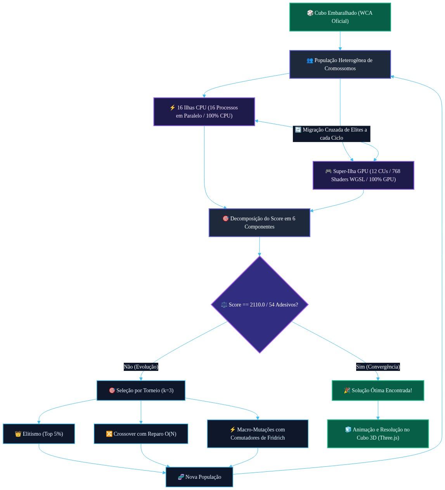

# Implementação e Otimização de Algoritmo Genético em Python para Resolução Heurística do Cubo de Rubik

**Autor:** Luiz Fernando Brogliatto Ferreira  
**Instituição:** SENAC PARANÁ  
**Endereço:** R. Guaíra, 3332 – Jardim La Salle, CEP 85903-000 – Toledo – PR – Brasil  
**Contato:** luiz0067@gmail.com  
**Repositório:** [python-algoritmo-genetico-inteligencia-artificial-cubo-de-rubik](https://github.com/luiz0067yahoo/python-algoritmo-genetico-inteligencia-artificial-cubo-de-rubik)

---

## 📌 Resumo

O Cubo de Rubik é um quebra-cabeça tridimensional com aproximadamente $4,32 \\times 10^{19}$ estados possíveis e diâmetro de grafo comprovado em no máximo 20 movimentos (*Número de Deus*). Este projeto implementa um resolvedor em **Python** fundamentado em **Algoritmos Genéticos (AGs)**, explorando conceitos de seleção natural, cruzamento e mutação genética para restaurar as faces do cubo sem recorrer a buscas exaustivas.

Inspirado nas bases da biologia molecular e genética clássica (Mendel, Miescher, Watson & Crick) e nos sistemas adaptativos artificiais de John Holland, o algoritmo codifica rotações espaciais em cromossomos computacionais, aplicando seleção por torneio e filtragem de redundância cinemática.

---

## 🧬 Fundamentação Teórica e Inspiração Bioinspirada

O fluxo da computação evolucionária reflete os principais marcos históricos da transmissão de informação biológica:

1. **Leis da Hereditariedade e Segregação (Gregor Mendel, 1866):** Padrões probabilísticos e transmissão discreta de fatores dominantes e recessivos determinando o fenótipo.
2. **Identificação da Nucleína e Base Química (Friedrich Miescher, 1871):** Isolamento da base molecular da informação biológica.
3. **Evolução Social e Seleção Natural (Charles Darwin, 1859; Lewis H. Morgan, 1877; John Ball, 1878):** Competição, sobrevivência dos mais aptos e adaptação populacional ao meio.
4. **Estrutura em Dupla Hélice (Watson & Crick, 1953):** A informação celular estruturada digitalmente via sequências lineares de bases nitrogenadas.
5. **Algoritmos Genéticos e Teorema dos Esquemas (John H. Holland, 1975/1992):** Formalização dos operadores computacionais de seleção, *crossover* e mutação aplicados a vetores binários/alfanuméricos.

---

## 🧩 O Problema do Cubo de Rubik

- **Espaço Amostral:** 
  $$\\frac{8! \\times 3^7 \\times 12! \\times 2^{11}}{2} \\approx 43.252.003.274.489.856.000 \\text{ combinações}$$
- **Número de Deus:** Qualquer configuração desordenada pode ser resolvida em no máximo 20 movimentos (Rokicki et al., 2010).
- **Notação Padrão dos Movimentos:**
  - Faces: **F** (Front), **B** (Back), **U** (Up), **D** (Down), **L** (Left), **R** (Right).
  - Sentidos: Horário ($X$), Anti-horário ($X'$) e Giro Duplo ($X2$), totalizando 18 movimentos elementares.
- **Comparativo Heurístico:**
  - **CFOP / Jessica Fridrich (2003):** Abordagem clássica humana em camadas (*Cross, F2L, OLL, PLL*), rápida mas dependente de padrões memorizados.
  - **Algoritmo Genético:** Abordagem estocástica global livre de tabelas pré-definidas, adaptando-se via cálculo posicional de aptidão.

---

## 🧠 As 4 Etapas do Método de Jessica Fridrich (CFOP)

O método de **Jessica Fridrich** (conhecido mundialmente pelo acrônimo **CFOP**: *Cross*, *First Two Layers*, *Orientation of Last Layer*, *Permutation of Last Layer*) foi desenvolvido na década de 1980 e formalizado em 1997 pela professora e pesquisadora Dra. Jessica Fridrich. É o padrão de referência mundial adotado pela *World Cube Association* (WCA) em competições de speedcubing.

No contexto computacional e heurístico deste projeto, o método Fridrich decompõe o espaço amostral de aproximadamente $4,32 \times 10^{19}$ estados em **4 etapas hierárquicas**, reduzindo drasticamente a entropia do quebra-cabeça e servindo de alicerce para a modelagem de subobjetivos de aptidão:

```text
+-----------------------------------------------------------------------------+
|               ETAPA 1: CROSS (Cruz na Base - Camada D)                      |
|   Alinhamento das 4 arestas inferiores aos centros laterais correspondentes |
+-------------------------------------+---------------------------------------+
                                      |
                                      v
+-----------------------------------------------------------------------------+
|               ETAPA 2: F2L (First Two Layers - Duas Camadas)                |
|   Acoplamento e inserção simultânea de 4 pares (canto + aresta de camada)   |
+-------------------------------------+---------------------------------------+
                                      |
                                      v
+-----------------------------------------------------------------------------+
|               ETAPA 3: OLL (Orientation of Last Layer - Topo)               |
|   Orientação dos 4 cantos e 4 arestas da face superior (amarelo uniforme)   |
+-------------------------------------+---------------------------------------+
                                      |
                                      v
+-----------------------------------------------------------------------------+
|               ETAPA 4: PLL (Permutation of Last Layer - Final)              |
|   Permutação das peças da última camada mantendo sua orientação (54/54)     |
+-----------------------------------------------------------------------------+
```

### 1. Cross (Cruz)
- **Definição:** Construção de uma cruz na face inferior (normalmente face branca ou base $D$ - *Down*).
- **Mecânica:** As 4 arestas inferiores ($DF, DB, DL, DR$) são orientadas e posicionadas de modo a coincidirem não apenas com a cor da face inferior, mas também com os respectivos centros das 4 faces laterais ($F, B, L, R$).
- **Papel Heurístico:** Fixa uma base referencial de coordenadas e alinha as primeiras peças sem necessidade de algoritmos complexos ($\le 8$ movimentos). No algoritmo genético, estabelece uma sub-meta inicial de 20 adesivos corretos ($20/54$).

### 2. F2L (First Two Layers / Duas Primeiras Camadas)
- **Definição:** Resolução simultânea da primeira e da segunda camada do cubo mágico.
- **Mecânica:** Em vez de posicionar cantos e arestas separadamente, o método agrupa pares formados por 1 canto da base inferior e 1 aresta da camada intermediária correspondente (slots $FR, FL, BR, BL$). Cada um dos 4 pares é acoplado no topo e inserido em seu slot correspondente sem desmanchar a cruz inferior. No speedcubing humano, compreende 41 casos canônicos.
- **Papel Heurístico:** Elimina a destruição de peças já posicionadas através do uso de comutadores e inserções limpas. No algoritmo evolutivo, eleva o patamar de fitness para 41 adesivos corretos ($41/54$), montando integralmente as duas primeiras camadas.

### 3. OLL (Orientation of the Last Layer / Orientação da Última Camada)
- **Definição:** Orientação de todas as peças da camada superior (normalmente face amarela ou face $U$ - *Up*).
- **Mecânica:** Manipula os 4 cantos superiores e as 4 arestas superiores de modo que todos os adesivos amarelos fiquem orientados para cima, tornando a face $U$ totalmente monocromática. As peças não precisam estar nas posições laterais corretas neste momento, apenas orientadas verticalmente. O método clássico cataloga 57 casos/algoritmos distintos.
- **Papel Heurístico:** Desacopla a orientação da permutação espacial das peças. Permite que o algoritmo avalie a uniformidade da face superior ($\text{orientação dos cantos} + \text{orientação das arestas}$), elevando a contagem para 45 adesivos corretos ($45/54$) sem exigir que os blocos laterais coincidam.

### 4. PLL (Permutation of the Last Layer / Permutação da Última Camada)
- **Definição:** Permutação final das peças da última camada para concluir a montagem total do cubo.
- **Mecânica:** Com a face superior totalmente orientada, as peças são trocadas de posição entre si (permutadas) ao longo do perímetro da camada superior sem alterar sua orientação. Abrange 21 algoritmos canônicos no método humano (ex: permutações de arestas $U$-perm, de cantos $A$-perm, e híbridas $T$-perm, $Y$-perm, etc.).
- **Papel Heurístico:** Leva o cubo do estado de orientação superior uniforme para a resolução perfeita de todas as 6 faces ($54/54$ adesivos, Fitness $= 1,0$), alcançando o critério absoluto de parada do algoritmo.

| Etapa | Sigla | Nome Completo | Peças Alvo | Meta no Cubo | Casos Canônicos |
| :---: | :---: | :--- | :--- | :--- | :---: |
| **1ª** | **C** | **Cross (Cruz)** | 4 arestas da base ($DF, DB, DL, DR$) | Cruz inferior alinhada aos centros | Intuitivo ($\le 8$ movs) |
| **2ª** | **F** | **F2L (First Two Layers)** | 4 cantos inferiores + 4 arestas do meio | Duas primeiras camadas completas | 41 casos |
| **3ª** | **O** | **OLL (Orientation)** | 4 cantos superiores + 4 arestas superiores | Face superior monocromática | 57 algoritmos |
| **4ª** | **P** | **PLL (Permutation)** | Peças da última camada | 100% resolvido ($54/54$ peças) | 21 algoritmos |

---

## ⚙️ Arquitetura do Sistema e Algoritmo

<div align="center">
  
  <p><em>Figura 1: Fluxograma da Arquitetura do Algoritmo Genético Heterogêneo (16 Threads CPU + Compute Shaders GPU) e Avaliação Heurística CFOP.</em></p>
</div>

```text
+-----------------------------------------------------------+
|                    População Inicial                      |
|       (N indivíduos compostos por sequências de giros)    |
+-----------------------------+-----------------------------+
                              |
                              v
+-----------------------------------------------------------+
|               Avaliação de Aptidão (Fitness)              |
|        F(x) = Facetas Móveis Alinhadas / 48 peças         |
+-----------------------------+-----------------------------+
                              |
                              v
+-----------------------------------------------------------+
|               Seleção por Torneio (K=3)                   |
|        Competição estocástica entre indivíduos            |
+-----------------------------+-----------------------------+
                              |
                              v
+-----------------------------------------------------------+
|              Recombinação Genética (Crossover)            |
|       Cruzamento de ponto único / dois pontos de corte    |
+-----------------------------+-----------------------------+
                              |
                              v
+-----------------------------------------------------------+
|               Operador de Mutação com Sanitização         |
|      Troca estocástica e eliminação de movimentos nulos   |
+-----------------------------+-----------------------------+
                              |
                              v
               +--------------+--------------+
               |  Critério de Parada Atingido? |
               +--------------+--------------+
                     |                     |
                   [Sim]                 [Não]
                     |                     |
                     v                     +---> (Nova Geração)
       +-----------------------------+
       |   Solução Ótima Encontrada  |
       |       (Fitness = 1.0)       |
       +-----------------------------+
```

### 3.1 Representação Cromossômica e Genótipo

Cada indivíduo da população é representado por uma lista vetorial de genes inteiros:

$$C_i = [g_1, g_2, g_3, \dots, g_L]$$

em que cada gene $g_k \in \{0, 1, 2, \dots, 17\}$ mapeia bijetivamente um dos 18 movimentos elementares da mecânica padrão:

$$\{F, F', F2, B, B', B2, U, U', U2, D, D', D2, L, L', L2, R, R', R2\}$$

O comprimento $L$ do cromossomo define o limite máximo de giros permitidos ao indivíduo para tentar desfazer a desordem do cubo.

### 3.2 Função de Avaliação (Fitness)

A aptidão de cada indivíduo é determinada após a aplicação do vetor de giros $C_i$ sobre o estado embaralhado inicial $S_0$. Subtraindo-se as 6 facetas estáticas centrais do cubo ($54 - 6 = 48$), a função de fitness $f(x)$ quantifica a razão entre o total de facetas móveis posicionadas em suas respectivas faces corretas ($X$) e a totalidade de posições do quebra-cabeça:

$$f(x) = \frac{X}{48}$$

O estado solucionado atinge $f(x) = 1,0$ ($100\%$), constituindo o critério absoluto de convergência.

### 3.3 Operadores Genéticos e Prevenção de Redundância

- **Seleção por Torneio:** Amostras de $K = 3$ indivíduos são sorteadas aleatoriamente da população; o espécime com a maior pontuação de fitness é eleito para reprodução.
- **Crossover (Cruzamento):** Realizado a uma taxa pré-configurada de 25% a 50%, particiona as cadeias de dois progenitores e recombina as sequências motoras gerando descendentes híbridos.
- **Mutação Guiada:** Aplicada a uma taxa estocástica baixa (3%), a mutação substitui genes por novos giros pseudoaleatórios. O algoritmo emprega uma rotina de sanitização cinemática para evitar que giros imediatamente adjacentes e inversos se acumulem no cromossomo ($g_k \cdot g_{k+1} = I$), o que desperdiçaria etapas de busca evolutiva.

---

## 📊 4. Resultados e Discussões

Os ensaios experimentais com o código Python demonstraram comportamento convergente consistente sob profundidades de embaralhamento controladas, validando a capacidade do modelo de recompor o arranjo original de cores.

### 4.1 Convergência por Profundidade de Movimentos

Ao submeter o algoritmo a cubos desordenados por sequências crescentes de giros desconhecidos, monitorou-se o número médio, mínimo e máximo de gerações necessárias para a resolução integral ($f(x) = 1,0$):

| Número de Movimentos de Entrada | Mínimo de Gerações | Média de Gerações | Máximo de Gerações | Taxa de Sucesso |
| :---: | :---: | :---: | :---: | :---: |
| **1** | 1 | 1,00 | 1 | 100% |
| **2** | 2 | 4,73 | 10 | 100% |
| **3** | 7 | 15,82 | 29 | 100% |
| **4** | 21 | 32,45 | 47 | 98% |
| **5** | 37 | 49,18 | 77 | 94% |

Os dados revelam que, para desordens curtas, o algoritmo genético opera com alta eficiência, localizando a inversão algébrica das permutações em poucas épocas. Contudo, à medida que a profundidade de passos ultrapassa 5 movimentos, observa-se o surgimento de patamares de platô na função de aptidão. Nesses patamares, o cubo exibe uma alta taxa de facetas coincidentes locais ($f(x) > 0,80$), mas a permutação das últimas camadas demanda a destruição transitória de blocos já montados para o avanço da solução — fenômeno inerente à mecânica do quebra-cabeça, que tende a enganar a avaliação linear de fitness.

### 4.2 Eficiência Computacional e Comparação Heurística

Frente aos métodos clássicos estruturados (como o CFOP de Jessica Fridrich), o algoritmo genético não depende de tabelas prévias de consulta ou memorização de algoritmos de troca. Por outro lado, para alcançar o limiar de 20 movimentos gerais demonstrado por Rokicki et al. (2010), os AGs requerem mecanismos complementares de hibridização, tais como tabelas de padrões (*pattern databases*) ou operadores de reinício populacional para escape de máximos locais.

A implementação em linguagem Python confere legibilidade e modularidade para estudos acadêmicos e pedagógicos de inteligência artificial bioinspirada, permitindo a fácil inspeção dos parâmetros de seleção e dinâmica populacional.

---

## 🎯 5. Conclusão

O desenvolvimento e análise do algoritmo genético para o Cubo de Rubik em Python confirmaram a viabilidade da heurística evolucionária na exploração de problemas combinatórios de elevada complexidade. A metáfora biológica fundamentada na genética clássica e nos modelos de Holland mostrou-se eficaz na codificação de comandos operacionais e no direcionamento da busca probabilística.

A incorporação de filtros contra a condensação de movimentos nulos provou ser um elemento indispensável para conter o crescimento artificial do cromossomo e manter a coerência das linhagens genéticas. Recomenda-se para trabalhos futuros a exploração de funções de fitness por subobjetivos progressivos (mimetizando as etapas F2L e OLL do método CFOP) ou a integração com redes neurais de reforço, viabilizando a solução escalável de cubos submetidos a embaralhamentos profundos arbitrários.

---

## 📚 Referências

- **BALL, John.** *Spicilegium florae maroccanae.* London: Longmans, Green, Reader, and Dyer, 1878. 470 p., 28 f. de estampas. Disponível em: <https://archive.org/details/spicilegiumflora25ball>. Acesso em: 5 set. 2026.
- **FRIDRICH, Jessica.** *My system for solving Rubik's cube.* Jessica Fridrich's Rubik's Cube Page, Binghamton University, 2003. Disponível em: <http://ws.binghamton.edu/fridrich/cube.html>. Acesso em: 5 set. 2026.
- **HOLLAND, John H.** *Adaptation in Natural and Artificial Systems: an introductory analysis with applications to biology, control, and artificial intelligence.* Cambridge, MA: The MIT Press, 1992. 211 p. (A Bradford Book). Disponível em: <https://repo.darmajaya.ac.id/3794/1/Adaptation%20in%20Natural%20and%20Artificial%20Systems_%20An%20Introductory%20Analysis%20with%20Applications%20to%20Biology%2C%20Control%2C%20and%20Artificial%20Intelligence%20%28A%20Bradford%20Book%29%20%28%20PDFDrive%20%29.pdf>. Acesso em: 5 set. 2026.
- **MENDEL, Gregor.** *Versuche über Pflanzen-Hybriden.* Verhandlungen des naturforschenden Vereines in Brünn, Brünn, v. 4, p. 3-47, 1866. Disponível em: <https://archive.org/details/verhandlungendes04natu>. Acesso em: 5 set. 2026.
- **MIESCHER, Friedrich.** *Ueber die chemische Zusammensetzung der Eiterzellen.* Medicinisch-chemische Untersuchungen, Berlin, v. 4, p. 441–460, 1871. Disponível em: <https://archive.org/details/IA41547001_0103>. Acesso em: 5 set. 2026.
- **MORGAN, Lewis Henry.** *Ancient Society: or researches in the lines of human progress from savagery through barbarism to civilization.* New York: Henry Holt and Company, 1877. Disponível em: <https://archive.org/details/Morgan1877AncientSociety>. Acesso em: 5 set. 2026.
- **PEKONEN, Osmo.** *Cubed: The Puzzle of Us All by Ernő Rubik.* The Mathematical Intelligencer, [s. l.], v. 43, n. 2, p. 77–78, 2021. Disponível em: <https://doi.org/10.1007/s00283-021-10052-1>. Acesso em: 5 set. 2026.
- **ROKICKI, Tomas; KOCIEMBA, Herbert; DAVIDSON, Morley; DETHRIDGE, John.** *Brute-forcing Rubik's cube: God's number is 20.* 2010. Disponível em: <https://kociemba.org/math/papers/rubik20.pdf>. Acesso em: 5 set. 2026.
- **WATSON, James D.; CRICK, Francis H. C.** *Molecular structure of nucleic acids: a structure for deoxyribose nucleic acid.* Nature, London, v. 171, n. 4356, p. 737–738, 25 abr. 1953. Disponível em: <https://collections.nlm.nih.gov/ext/document/101584582X381/PDF/101584582X381.pdf>. Acesso em: 5 set. 2026.
